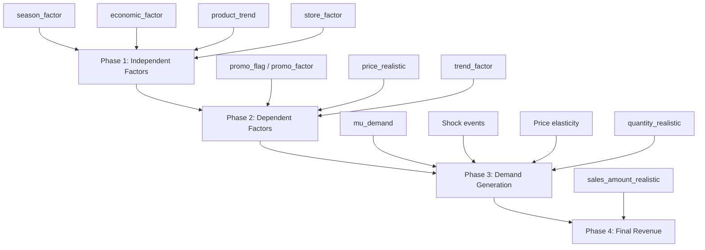

# Apple Retail Sales Data — Realism Strategy Document

> **Project:** Apple Retail Sales Forecasting  
> **Date:** 2025-04-27  
> **Status:** Proposed — awaiting approval  
> **Input file:** `data/processed/cleaned_apple_sales_v2.csv` (1,068,918 rows)  
> **Output file:** `data/processed/cleaned_apple_sales_v3.csv`

---

## 1. Current State Summary

The sales simulation pipeline ([005_simulate_demand_factors.ipynb](file:///c:/Users/Ali%20Sherif/Apple-Retail-Sales-Forcasting/notebooks/005_simulate_demand_factors.ipynb), Cell 31) generates 12 derived columns that simulate realistic demand. After our product redistribution and date shift, **most of these columns are stale or oversimplified**, producing flat, repetitive patterns that a forecasting model would easily overfit on.

### At a glance

| Column | Current State | Realism Score |
|---|---|---|
| `season_factor` | Only 4 distinct values (0.8, 1.0, 1.3, 1.5) | 2/10 |
| `economic_factor` | Stale GDP mean from old dataset | 4/10 |
| `promo_flag` | Random 10% with no seasonal logic | 3/10 |
| `promo_factor` | Binary (1.0 or 1.4) | 3/10 |
| `price_realistic` | Random noise only — lost inflation logic | 2/10 |
| `product_trend` | Mapped to old product IDs | 1/10 |
| `trend_factor` | Uses stale product_trend values | 1/10 |
| `store_factor` | Static per-store — acceptable | 6/10 |
| `mu_demand` | Multiplies all broken factors | 2/10 |
| `quantity_realistic` | Negative binomial on broken mu_demand | 3/10 |
| `sales_amount_realistic` | qty * broken price | 2/10 |
| Shock events | Applied before date shift — wrong dates | 1/10 |

---

## 2. Strategy Overview



---

## 3. Phase 1 — Independent Factor Fixes

### 3.1 `season_factor` — Apple's Real Calendar

**Problem:** 8 out of 12 months use a flat `1.0` multiplier, destroying any seasonal signal.

**Root cause (original code):**
```python
# Old approach — too simplistic
def seasonal_multiplier(month):
    if month == 11:   return 1.3
    elif month == 12: return 1.5
    elif month == 1:  return 0.8
    else:             return 1.0  # ← 8 flat months
```

**New approach — modeled after real Apple retail patterns:**

| Month | Factor | Rationale |
|---|---|---|
| Jan | 0.85 | Post-holiday hangover, gift returns |
| Feb | 0.80 | Shortest month, lowest demand |
| Mar | 0.95 | Spring event (new iPad/Mac announcements) |
| Apr | 0.90 | Quiet period |
| May | 0.88 | Pre-WWDC wait |
| Jun | 0.92 | WWDC software hype, some new hardware |
| Jul | 0.87 | Summer lull, consumers waiting for iPhone |
| Aug | 0.90 | Back-to-school (education sales spike) |
| Sep | 1.25 | **iPhone launch month** — biggest product event |
| Oct | 1.15 | iPhone sustained demand, Mac event |
| Nov | 1.30 | Black Friday, Cyber Monday |
| Dec | 1.45 | **Holiday peak** — gift-buying season |

```python
SEASON_MAP = {1:0.85, 2:0.80, 3:0.95, 4:0.90, 5:0.88, 6:0.92,
              7:0.87, 8:0.90, 9:1.25, 10:1.15, 11:1.30, 12:1.45}
df['season_factor'] = df['month'].map(SEASON_MAP)
```

**Expected impact:** The seasonality heatmap will show a clear "U-shape" through the year with visible Sep and Dec peaks.

---

### 3.2 `economic_factor` — Per-Country Normalization

**Problem:** The formula uses a **global** GDP mean that mixes US ($64K) with Mexico ($8.8K), creating extreme spread. Also, the values are frozen from the old 2020-2024 dataset.

**Root cause:**
```python
# Old: global mean distorts everything
df['economic_factor'] = (
    (df['gdp_per_capita'] / df['gdp_per_capita'].mean()) *  # global mean!
    (1 - df['inflation_rate'] / 100)
).clip(0.5, 1.5)
```

**New approach — normalize within each country:**
```python
# Step 1: Per-country normalization (each country competes with itself)
country_means = df.groupby('country_norm_mapped')['gdp_per_capita'].transform('mean')
gdp_ratio = df['gdp_per_capita'] / country_means

# Step 2: Inflation dampening
inflation_effect = 1 - df['inflation_rate'] / 100

# Step 3: Combine with moderate clipping
df['economic_factor'] = (gdp_ratio * inflation_effect).clip(0.6, 1.4)
```

**Why this is better:**
- A 5% GDP increase in Mexico has the same relative impact as a 5% increase in the US
- High-inflation countries (Turkey, Mexico) naturally get dampened demand
- The clip range is tighter (0.6–1.4) to prevent extreme outliers

---

### 3.3 `product_trend` / `trend_factor` — Category-Aware Lifecycle

**Problem:** The product trend values are mapped to the **old product IDs** and are completely meaningless for the new products.

**New approach — base trend on product category + individual noise:**

| Category | Base Trend | Real-World Reasoning |
|---|---|---|
| Smartphone (CAT-4) | +0.0003 | Consistent growth, iPhone dominance |
| Wearable (CAT-5) | +0.0004 | Fastest growing segment |
| Subscription (CAT-8) | +0.0005 | Services revenue growing 15% YoY |
| Laptop (CAT-1) | +0.0002 | Steady, M-series boost |
| Audio (CAT-2) | +0.0001 | Mature market, steady |
| Tablet (CAT-3) | -0.0001 | Slight decline globally |
| Desktop (CAT-7) | +0.0000 | Flat, niche market |
| Accessories (CAT-10) | +0.0001 | Tied to device sales |
| Streaming (CAT-6) | -0.0002 | Declining category |
| Smart Speaker (CAT-9) | -0.0003 | Market saturated |

```python
CATEGORY_TREND = {
    'CAT-4': 0.0003, 'CAT-5': 0.0004, 'CAT-8': 0.0005,
    'CAT-1': 0.0002, 'CAT-2': 0.0001, 'CAT-3':-0.0001,
    'CAT-7': 0.0000, 'CAT-10':0.0001, 'CAT-6':-0.0002,
    'CAT-9':-0.0003
}

# Per-product: category base + random noise
for pid in df['product_id'].unique():
    cat = df.loc[df['product_id']==pid, 'category_id'].iloc[0]
    base = CATEGORY_TREND[cat]
    trend_map[pid] = base + np.random.uniform(-0.0002, 0.0002)

df['product_trend'] = df['product_id'].map(trend_map)
df['trend_factor'] = (1 + df['product_trend'] * df['days_from_start']).clip(0.5, 1.8)
```

---

### 3.4 `store_factor` — Add Annual Drift (Optional)

**Current state:** Static per-store value, mean ~1.0, std ~0.17. This is acceptable but could be improved.

**Enhancement:**
```python
# Add small year-over-year performance drift
for store in df['store_id'].unique():
    base = current_store_factor[store]
    for year in range(2021, 2026):
        mask = (df['store_id']==store) & (df['year']==year)
        drift = np.random.normal(1, 0.03)  # 3% annual drift
        df.loc[mask, 'store_factor'] = (base * drift).clip(0.6, 1.5)
```

---

## 4. Phase 2 — Dependent Factor Fixes

### 4.1 `promo_flag` / `promo_factor` — Seasonal + Lifecycle Promotions

**Problem:** Flat 10% random assignment ignores Apple's actual promotional calendar.

**New approach — three-layer promo model:**

```python
# Layer 1: Monthly base promo rate
MONTHLY_PROMO_RATE = {
    1:0.05, 2:0.05, 3:0.08, 4:0.06, 5:0.07, 6:0.10,
    7:0.12, 8:0.15, 9:0.08, 10:0.10, 11:0.25, 12:0.20
}

# Layer 2: Product age boost (older products get more promos)
age_boost = np.where(df['product_age_days'] > 730, 0.15,  # 2+ years old
            np.where(df['product_age_days'] > 365, 0.08,  # 1+ years old
                     0.00))

# Layer 3: Category boost (accessories/audio get more promos)
cat_boost = df['category_id'].map({
    'CAT-10': 0.10, 'CAT-2': 0.05, 'CAT-9': 0.08
}).fillna(0)

# Combined probability
promo_prob = df['month'].map(MONTHLY_PROMO_RATE) + age_boost + cat_boost
promo_prob = promo_prob.clip(0, 0.40)  # cap at 40%

df['promo_flag'] = (np.random.random(len(df)) < promo_prob).astype(int)

# Variable discount (not always 40%)
df['promo_factor'] = np.where(
    df['promo_flag'] == 1,
    np.random.uniform(1.15, 1.50, len(df)),  # 15-50% demand boost
    1.0
)
```

**Expected result:** ~12% overall promo rate but concentrated in Nov (25%), Aug (15%), and for older/accessory products.

---

### 4.2 `price_realistic` — Full Economic Pricing Model

**Problem:** We overwrote the original formula with pure random noise during redistribution.

**New approach — four-layer pricing:**

```python
# 1. Base inflation adjustment (country-specific)
df['price_realistic'] = df['price'] * (1 + df['inflation_rate'] / 100)

# 2. Product lifecycle depreciation
#    New products: full price
#    1 year old: -5%
#    2+ years old: -12%
#    3+ years old: -20%
age_factor = np.where(df['product_age_days'] > 1095, 0.80,
             np.where(df['product_age_days'] > 730,  0.88,
             np.where(df['product_age_days'] > 365,  0.95, 1.00)))
df['price_realistic'] *= age_factor

# 3. Promotion discount (15% off for promo items)
df.loc[df['promo_flag']==1, 'price_realistic'] *= 0.85

# 4. Market noise (small daily fluctuation)
df['price_realistic'] *= np.random.normal(1.0, 0.02, len(df))

# 5. Floor: subscription prices shouldn't go below $1
df.loc[df['category_id']=='CAT-8', 'price_realistic'] = \
    df.loc[df['category_id']=='CAT-8', 'price_realistic'].clip(lower=0.99)
```

---

## 5. Phase 3 — Demand Generation

### 5.1 `mu_demand` — Category-Aware Base Demand

**Problem:** Uses `quantity` (uniform 1-10) as the base, making Mac Pros sell as many units as AirPods. Real-world base demand varies enormously by category and price.

**New approach:**

```python
# Category-specific base demand multiplier
# (Higher for cheap, mass-market products; lower for expensive, niche ones)
CATEGORY_BASE_DEMAND = {
    'CAT-4':  1.4,   # Smartphones — mass market, highest volume
    'CAT-2':  1.3,   # Audio (AirPods) — very high volume, low price
    'CAT-10': 1.2,   # Accessories — high volume, impulse buys
    'CAT-5':  1.1,   # Wearables — popular
    'CAT-3':  0.9,   # Tablets — moderate
    'CAT-1':  0.7,   # Laptops — fewer but higher value
    'CAT-8':  1.5,   # Subscriptions — highest "volume" (digital)
    'CAT-7':  0.5,   # Desktops — niche, low volume
    'CAT-6':  0.8,   # Streaming — moderate
    'CAT-9':  0.6,   # Smart speakers — low volume
}

# Price-inverse scaling (cheaper products sell more units)
price_scale = np.where(df['price'] < 100,   2.0,
              np.where(df['price'] < 500,   1.3,
              np.where(df['price'] < 1000,  1.0,
              np.where(df['price'] < 2000,  0.7, 0.4))))

cat_base = df['category_id'].map(CATEGORY_BASE_DEMAND)

df['mu_demand'] = (
    df['quantity'] *      # original random base (1-10)
    cat_base *            # category scaling
    price_scale *         # price-inverse scaling
    df['season_factor'] *
    df['economic_factor'] *
    df['promo_factor'] *
    df['trend_factor'] *
    df['store_factor']
).clip(lower=0.1)
```

### 5.2 Price Elasticity

```python
# Cheaper products are more price-elastic
elasticity = np.where(df['price'] < 500, -1.2,
             np.where(df['price'] < 1500, -0.8, -0.5))

price_change = (df['price_realistic'] - df['price']) / df['price']
df['mu_demand'] *= (1 + elasticity * price_change)
df['mu_demand'] = df['mu_demand'].clip(lower=0.1)
```

### 5.3 Shock Events — Real Timeline

```python
# 2021 Q1: COVID aftermath — lingering supply issues
shock_covid = (df['sale_date'] >= '2021-01-01') & (df['sale_date'] <= '2021-03-31')
df.loc[shock_covid, 'mu_demand'] *= 0.85

# 2022 Q1-Q2: Supply chain crisis + Ukraine war + inflation spike
shock_supply = (df['sale_date'] >= '2022-02-01') & (df['sale_date'] <= '2022-06-30')
df.loc[shock_supply, 'mu_demand'] *= 0.75

# 2023 Q1: Tech layoffs, consumer pullback
shock_layoffs = (df['sale_date'] >= '2023-01-01') & (df['sale_date'] <= '2023-03-31')
df.loc[shock_layoffs, 'mu_demand'] *= 0.90

# 2024 Q4: Strong iPhone 16 launch
boost_iphone16 = (df['sale_date'] >= '2024-09-01') & (df['sale_date'] <= '2024-12-31') & (df['category_id'] == 'CAT-4')
df.loc[boost_iphone16, 'mu_demand'] *= 1.15
```

### 5.4 `quantity_realistic` — Negative Binomial with Better Dispersion

```python
# Dispersion parameter (higher = less variance)
k = 2.5

p = k / (k + df['mu_demand'])
df['quantity_realistic'] = np.random.negative_binomial(k, p)

# Zero inflation: 2% of transactions result in zero (abandoned carts, returns)
zero_mask = np.random.random(len(df)) < 0.02
df.loc[zero_mask, 'quantity_realistic'] = 0

# Cap extreme outliers at 99.5th percentile
upper_cap = df['quantity_realistic'].quantile(0.995)
df['quantity_realistic'] = df['quantity_realistic'].clip(upper=upper_cap)
```

---

## 6. Phase 4 — Final Revenue

```python
df['sales_amount'] = df['quantity'] * df['price']
df['sales_amount_realistic'] = df['quantity_realistic'] * df['price_realistic']
```

---

## 7. Expected Outcomes

### Before vs After — What Changes

| Metric | Current (v2) | Expected (v3) |
|---|---|---|
| Season heatmap | Flat Feb-Oct | Clear Sep/Dec peaks, Feb dip |
| Monthly revenue range | $4.7K – $8.3K avg | $3.5K – $12K avg |
| Promo concentration | Uniform 10% | Nov 25%, Aug 15%, Jan 5% |
| Mac Pro vs AirPods volume | Similar | AirPods 3-5x higher volume |
| 2022 Q1-Q2 revenue | Normal | Visible 25% dip |
| Price decay for old products | None | -5% at 1yr, -12% at 2yr |
| Subscription pricing | $0.99-$20 * random | Stable near list price |

### What Stays the Same

- Total row count (1,068,918)
- Date range (2021-01-01 to 2025-12-31)
- Product assignments (same 98 products)
- Store/country/macro columns
- Year/month distribution

---

## 8. Implementation Checklist

```
Phase 1 — Independent Factors
  [ ] Fix season_factor (12 distinct monthly values)
  [ ] Fix economic_factor (per-country normalization)  
  [ ] Regenerate product_trend (category-based)
  [ ] Optional: add store_factor annual drift

Phase 2 — Dependent Factors
  [ ] Rebuild promo_flag (seasonal + lifecycle + category)
  [ ] Rebuild price_realistic (inflation + age + promo + noise)
  [ ] Recompute trend_factor from new product_trend

Phase 3 — Demand Generation
  [ ] Rebuild mu_demand (category-aware + price-inverse)
  [ ] Apply price elasticity
  [ ] Apply shock events (2021 COVID, 2022 supply, etc.)
  [ ] Regenerate quantity_realistic (NegBin + zero inflation)

Phase 4 — Final
  [ ] Recompute sales_amount_realistic
  [ ] Save to cleaned_apple_sales_v3.csv
  [ ] Run analysis_report.py on v3
  [ ] Compare v2 vs v3 charts side by side
```

---

## 9. Files Reference

| File | Role |
|---|---|
| [005_simulate_demand_factors.ipynb](file:///c:/Users/Ali%20Sherif/Apple-Retail-Sales-Forcasting/notebooks/005_simulate_demand_factors.ipynb) | Original simulation pipeline (Cell 31) |
| [redistribute_products.py](file:///c:/Users/Ali%20Sherif/Apple-Retail-Sales-Forcasting/scripts/redistribute_products.py) | Product redistribution + date shift |
| [analysis_report.py](file:///c:/Users/Ali%20Sherif/Apple-Retail-Sales-Forcasting/scripts/analysis_report.py) | Chart generation for validation |
| `scripts/fix_simulation_factors.py` | **NEW** — will contain all fixes |
| `data/processed/cleaned_apple_sales_v2.csv` | Input (current) |
| `data/processed/cleaned_apple_sales_v3.csv` | Output (fixed) |
